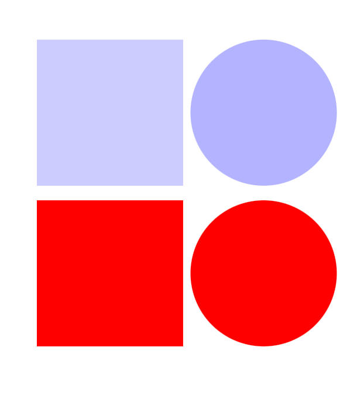

[Toc]

### 形状

#### rect circle
```
<svg xmlns="http://www.w3.org/2000/svg" viewBox="0 0 210 210">
    <g>
        <rect x="0" y="0" width="100" height="100" fill="blue" opacity=".2"></rect>
        <rect x="0" y="110" width="100" height="100" style="fill:red;"></rect>
    </g>
    <g>
        <circle cx="155" cy="50" r="50" fill="blue" opacity=".3"></circle>
        <circle cx="155" cy="160" r="50" style="fill:red;"></circle>
    </g>
</svg>
```
* viewBox 视窗范围
* x,y 定位
* width,height 设置尺寸
* fill 填充颜色 
* opacity 设置透明度
  
  


### 动画

#### animate
```
<animate 
attributeName="width" 
begin="click+5s" 
calcMode="spline" 
dur="1.5s" 
fill="freeze" 
keySplines="0.42 0 0.58 1;0.42 0 0.58 1" 
restart="always" 
values="100%;200%;200%"></animate>
```
* 用户点击元素5秒后开始，将元素的宽度从初始值逐渐增加到200%，然后保持在200%的宽度上(实际也影响到高度，在一些撑高的场景就是通过此手段)。动画持续时间为1.5秒，使用贝塞尔曲线控制动画插值，以实现平滑的动画效果。

属性：
- `attributeName`：指定SVG元素正在被动画化的属性名称，这里是`width`。
- `begin`：指定动画应该何时开始，这里是在用户点击元素5秒后开始。
- `calcMode`：指定动画值的计算方式，这里是`spline`，表示使用贝塞尔曲线控制动画插值。
- `dur`：指定动画的持续时间，这里是1.5秒。
- `fill`：指定动画结束后是否应该保持最终状态，这里是`freeze`，表示保持在200%的宽度上。
- `keySplines`：指定控制动画插值的贝塞尔曲线，这里使用两个贝塞尔曲线，分别对应动画值从100%到200%和从200%到200%的过程。
- `restart`：指定动画应该何时重新启动，这里是`always`，表示动画将在结束后立即重新启动。
- `values`：指定动画期间属性将采取的值，这里是从100%逐渐增加到200%，然后保持在200%的宽度上。

* 贝塞尔曲线 https://cubic-bezier.com/#.42,0,.58,1

#### animateTransform


#### foreignObject
