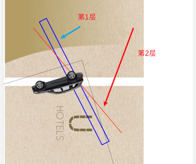

### 中心点

```
<svg xmlns="http://www.w3.org/2000/svg" viewBox="0 0 100 100">
    <rect x="25" y="25" width="50" height="50" fill="blue" transform="rotate(45 50 50)" />
</svg>

<div style="width: 100px; height: 100px; background-color: blue; transform: rotate(45deg); transform-origin: 20px 80px;"></div>

```
* 默认都是中心点
* 可以通过css设置 transform-origin 改变中心点


### 场景
* 通过设置父容器高度为0，自己旋转180deg, 父容易旋转360deg 实现层遮盖


```
<section style="height: 0;font-size: 0;transform: scale(1, 1) rotate(360deg);-webkit-transform: scale(1, 1) rotate(360deg);-moz-transform: scale(1, 1) rotate(360deg);-ms-transform: scale(1, 1) rotate(360deg);">
    <section style="height: 0;line-height: 0;font-size: 0;isolation: isolate;transform: rotate(180deg);-webkit-transform: rotate(180deg);-moz-transform: rotate(180deg);-ms-transform: rotate(180deg);-o-transform: rotate(180deg);">
        <svg style="width: 100%;outline: none;user-select: none;box-sizing: border-box;pointer-events: none;display: inline-block;vertical-align: top;background-size: 100.1% 100.1%;background-repeat: no-repeat;background-position: center center;background-image: url(car.png);transform: rotate(180deg);-webkit-transform: rotate(180deg);-moz-transform: rotate(180deg);-ms-transform: rotate(180deg);-o-transform: rotate(180deg);" viewbox="0 0 888 1690" x="0" y="0"></svg>
    </section>
</section>
```
* 父容器高度0是核心




### 案例
* https://mp.weixin.qq.com/s/YneZKYFxtheg74YfKsT8Mw
